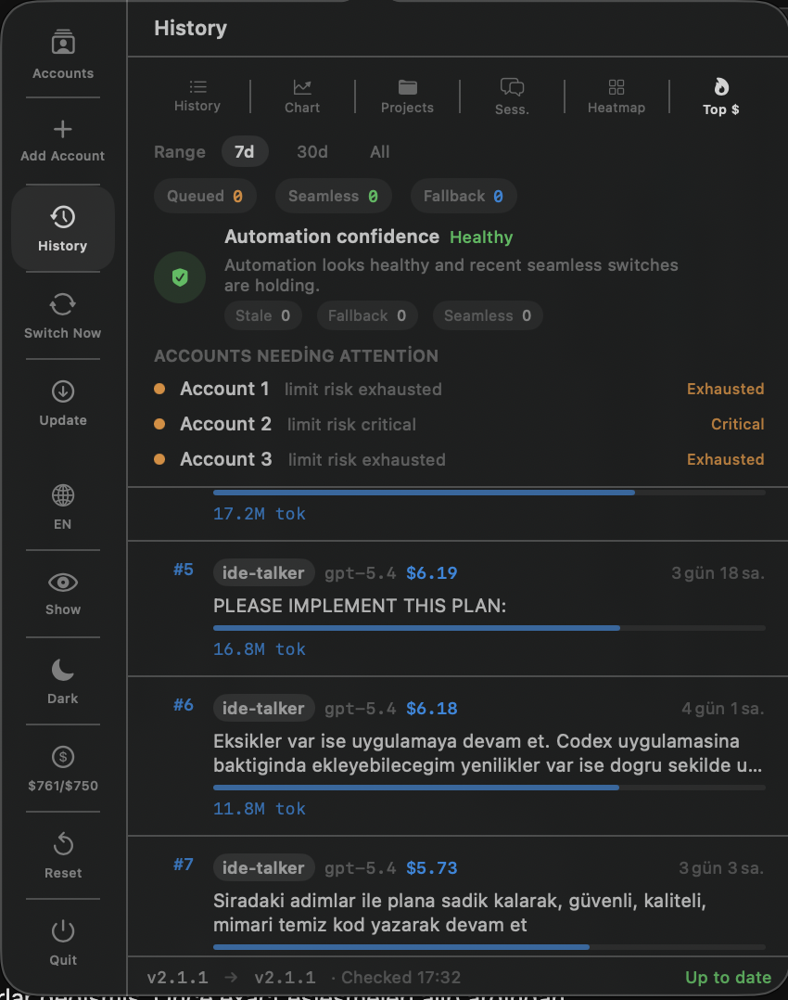
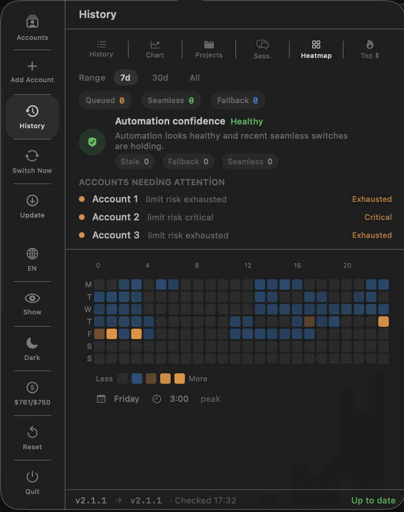
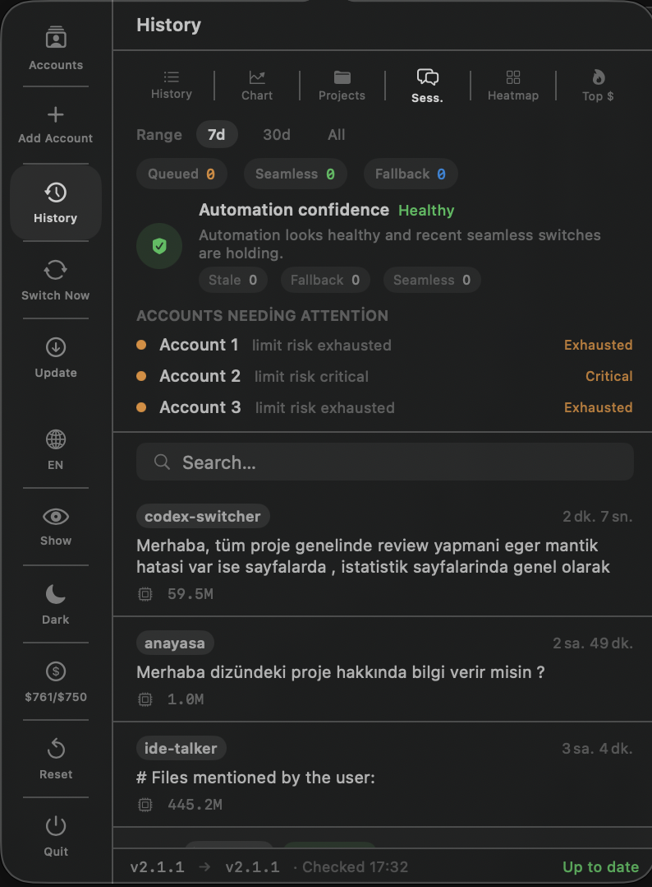
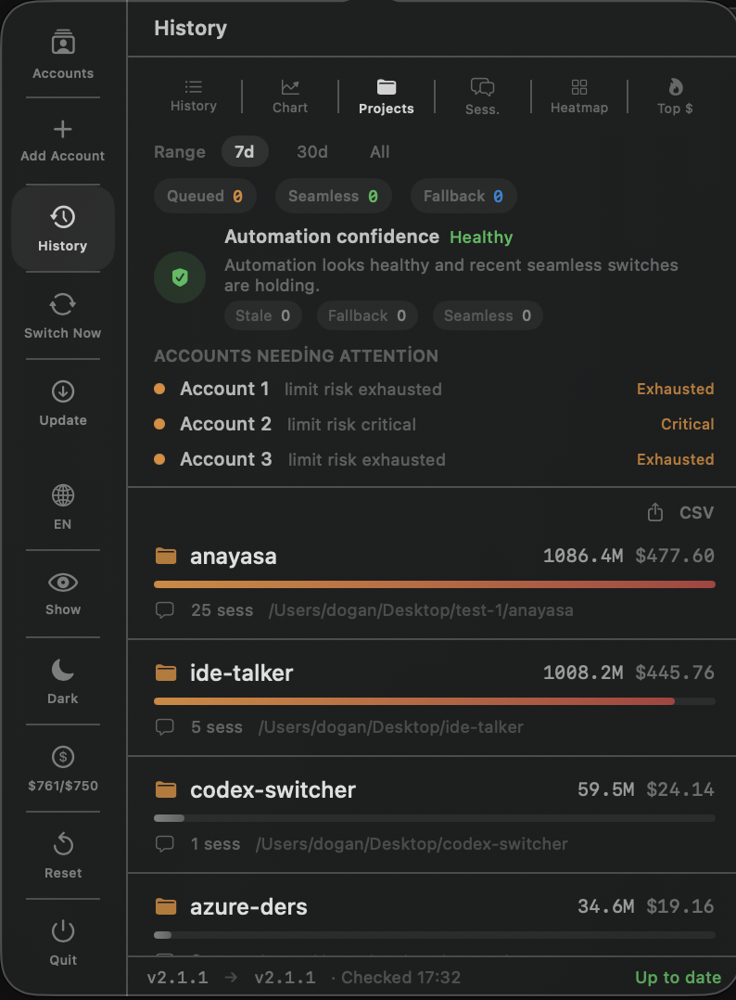
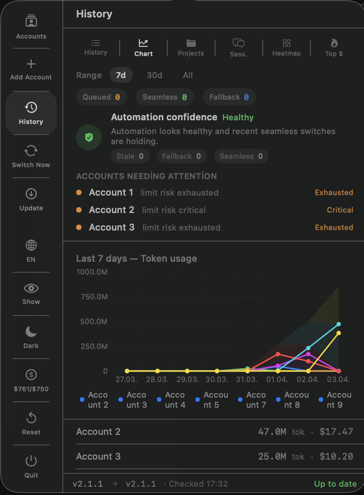
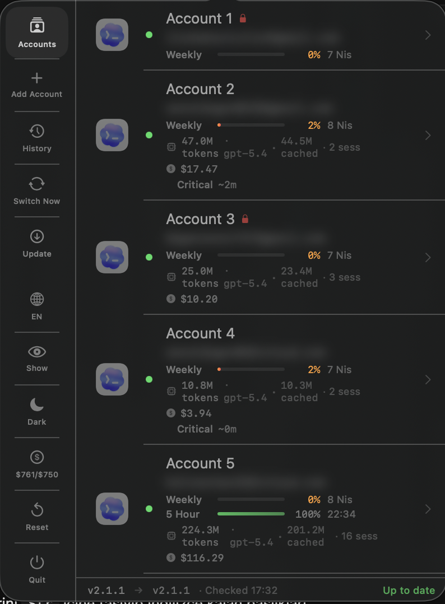

# CodexSwitcher

A macOS menu bar app that manages multiple OpenAI Codex accounts, automatically switches between them when usage limits are reached, and gives you deep analytics on your AI coding sessions.


<p align="center">
  
</p>

<p align="center">
  
  
  
</p>

<p align="center">
  
  
  
</p>

---

## Features

### Account Management
- **Auto-switching** — Detects weekly and 5-hour pressure via API and switches to the best available account automatically
- **Smart selection** — Picks the account with the lowest weekly usage %, not round-robin
- **Proactive thresholds** — Leaves the active account before hard exhaustion at `weekly <= 5%` or `5-hour <= 7%`
- **Background cutover refresh** — When Codex is active, the app refreshes its bundled background runtime on switch so the new account is actually applied without closing the window
- **Switch verification** — Switch telemetry records queued, restarted, and fallback states for postmortems
- **Re-login flow** — Refresh stale tokens without leaving the app
- **Account aliases** — Friendly names per account, rename via right-click
- **Auth recovery** — Automatic recovery if `~/.codex/auth.json` is corrupted

### Token & Cost Tracking
- **Per-event token attribution** — Accurate per-account tracking using delta computation from JSONL session files
- **Real input/output split** — Cost calculation uses actual `input_tokens`/`output_tokens` from session logs (not a rough approximation)
- **Cost tracking** — Per-account USD cost with model-specific pricing for gpt-4.x, gpt-5.x, o3, o4-mini
- **Rate limit bars** — Weekly and 5-hour remaining progress bars per account
- **Rate limit forecasting** — Estimates time-to-exhaustion based on usage pace
- **80% warning** — Notification when an account approaches its weekly limit
- **Restored notifications** — Get notified when a limited account becomes available again
- **Weekly budget alerts** — Set a USD budget; receive a notification when you exceed it
- **Weekly summary** — Automatic Sunday evening stats notification

### Codex Insights (Analytics)
- **Projects** — All-time per-project token and cost breakdown with progress bars; drill down into sessions per project; CSV export
- **Sessions** — Full session list with search, parent/child threading, agent role badges (reviewer, explorer, worker)
- **Heatmap** — 7-day × 24-hour activity heatmap showing when you code most
- **Top $** — Top 20 most expensive prompts ranked by USD cost
- **Chart** — 7-day daily token usage chart per account
- **Reconciliation ledger** — Provider-side limit drops are matched against local usage with explained, weak, unexplained, idle, and ignored windows
- **Forensic export** — Ledger rows export as CSV/JSON with reason codes, confidence, matched sessions, and policy metadata

### UI & UX
- **Account health indicators** — 🟢 healthy · 🟡 stale token · ⚪ unchecked · 🔒 exhausted
- **Live session indicator** — Green pulse when tokens are actively being consumed
- **Switch history** — Full log with type icons: ⚡ auto-switch · ↔ manual switch
- **Automation timeline** — Queued, ready, verifying, seamless, fallback, and inconclusive switch events with timing details
- **Automation confidence** — In-app health summary for stale auth, fallback pressure, and stuck pending switches
- **Email privacy** — One-click blur toggle for email addresses
- **Dark / Light mode** — Persistent appearance preference
- **TR / EN language** — Turkish and English UI (auto-detects system language)
- **Update checker** — GitHub-based update notifications (no Sparkle dependency)

---

## Requirements

- macOS 26 (Tahoe) or later
- [OpenAI Codex CLI](https://github.com/openai/codex) installed

---

## Installation

1. Download `CodexSwitcher-vX.X.X-signed.zip` from the [Releases](../../releases) page
2. Unzip and move `CodexSwitcher.app` to `/Applications`
3. Launch — the app appears in the menu bar

> Signed with a Developer ID certificate and notarized by Apple. No Gatekeeper warning on first launch.

To launch at login: **System Settings → General → Login Items** → add `CodexSwitcher`.

## Release Automation

Single command local release flow:

```bash
./scripts/release.sh 10585e36-d130-478a-b63a-5b871d472338
```

What it does:
- runs `swift test`
- builds the signed and notarized app
- reads the version from `Info.plist`
- validates the matching changelog entry in `README.md`
- creates/pushes the git tag if needed
- creates or updates the GitHub release and uploads the signed zip

---

## How It Works

```
~/.codex/auth.json              ← active Codex credentials (Codex reads this)
~/.codex/sessions/**/*.jsonl    ← session logs (token usage, prompts, models)
~/.codex-switcher/profiles/     ← stored credentials per account
~/.codex-switcher/cache/        ← token delta cache for fast attribution
```

1. CodexSwitcher watches `~/.codex/sessions/` for rate-limit signals
2. On detection it calls the rate-limit API to **confirm** the limit is actually reached (no false positives)
3. If confirmed, it atomically replaces `~/.codex/auth.json` with the best available account
4. If work is still active, the switch is queued until a safe boundary is reached
5. If Codex is active, CodexSwitcher refreshes the bundled background runtime during switch so the new account is guaranteed to take effect without closing the window
6. Analytics keeps a reconciliation ledger so provider-side limit drops can be compared against local activity later

Token attribution reads `input_tokens`, `cached_input_tokens`, and `output_tokens` from each session's JSONL events and maps them to the account that was active at that timestamp.

---

## Adding Accounts

1. Click **+ Add Account**
2. Browser opens automatically for OAuth sign-in
3. Sign in — CodexSwitcher detects the new credentials automatically
4. Give the account an alias → click **Save**

---

## Usage

| Action | How |
|--------|-----|
| Switch account | Click an account row |
| Force switch to next | **Switch Now** in the footer |
| View switch history | **History** tab |
| View analytics | **Chart / Projects / Sess. / Heatmap / Top $** tabs |
| Rename account | Right-click → **Rename** |
| Delete account | Right-click → **Delete** |
| Re-login stale account | Right-click → **Re-login** |
| Set weekly budget | Settings bar → **$X/$Y** button |
| Reset token statistics | Settings bar → **↺** (with confirmation) |
| Blur/show emails | Settings bar → **Show/Hide** |
| Toggle dark/light | Settings bar → **Dark/Light** |
| Change language | Settings bar → **🌐** (Auto → TR → EN) |
| Check for updates | Footer → **Update** (opens GitHub releases page) |

---

## Changelog

### v2.2.5
- **Crash-screen recovery** — If Codex shows its `An error has occurred` page after a background account refresh, CodexSwitcher now auto-clicks `Reload` so the window recovers without manual intervention
- **UI-stays-open hotfix** — The background cutover path now includes automatic window recovery instead of leaving the user on the SIGTERM crash page

### v2.2.4
- **Background Codex refresh** — Account switching now refreshes Codex's bundled app-server in the background so the window stays open while the new account is loaded
- **Limit-stuck recovery** — Switched accounts no longer depend on a full visible Codex relaunch to escape stale `you hit limit` local sessions
- **Drag-to-reorder accounts** — Account rows in the menu can now be picked up and moved anywhere in the stack, with the new order persisted across launches
- **Appearance settings screen** — Added a dedicated Settings view with theme mode, text size, text family, accent color presets, and a live preview card
- **Theme-aware menu polish** — Menu highlights, active indicators, progress bars, and analytics summary accents now follow the selected appearance preset
- **Switch reliability foundation** — Added typed switch decision records, readiness evaluation, bounded decision persistence, and safer manual override behavior so automatic and manual switching are both more explainable
- **Unified diagnostics timeline** — Added a diagnostics layer that merges switch decisions, automation events, reconciliation anomalies, alerts, and data-quality signals into one bounded operational timeline
- **Workflow intelligence** — Added read-only local Codex thread intelligence from `state_5.sqlite` with recent thread activity, repo hot spots, and open spawn-edge visibility in the analytics window
- **Power-user guidance** — Added contextual next-action recommendations and remembered analytics history tab state so returning users can move faster through the app
- **Diagnostics export expansion** — JSON audit exports now include diagnostics summary and timeline data without leaking prompt text or local project paths
- **Midnight session counting fix** — Session usage tracking now scans day boundaries correctly, fixing the release-blocking cache regression test around midnight
- **Regression coverage** — Added targeted tests for diagnostics timeline generation, workflow summary loading, recommendation logic, expanded analytics export payloads, and corrected session-usage caching behavior

### v2.2.2
- **Launch crash fix** — Moved the notification permission request out of `AppStore` initialization so the menu bar app no longer aborts during early startup on some macOS setups
- **Safer permission bootstrap** — Notification authorization is now requested from a deferred, one-shot launch bootstrap instead of eager singleton construction
- **Regression coverage** — Added targeted tests for deferred notification permission scheduling and single-run gating

### v2.1.4
- **Reconciliation ledger UI** — The analytics window now shows a sortable forensic ledger with summary pills, reason codes, confidence labels, and row drilldown
- **Forensic export hardening** — CSV/JSON exports now carry reconciliation rows and policy metadata without prompt text or local project paths
- **Proactive switch thresholds** — Automatic switching now reacts at `weekly <= 5%` or `5-hour <= 7%` instead of waiting for hard exhaustion
- **Guaranteed Codex cutover** — Account switches restart a running Codex process so the active CLI does not stay pinned to the exhausted account
- **Unsafe manual switch guard** — Manual selection and `Switch Now` now skip accounts that are already below safe weekly/5-hour thresholds, avoiding pointless restarts
- **Legacy cleanup** — Old audit generation logic has been retired internally while compatibility export fields remain bounded for migration

### v2.1.3
- **Audit export** — Added direct `CSV` and `JSON` export for trust/audit data from the analytics window
- **Provider delta evidence** — Export payload now captures audit summary, full drain event rows, and timeline points for offline inspection
- **Idle drain forensics** — Idle-window suspicious drops can now be shared and reviewed outside the app instead of staying only in the UI
- **Audit exporter tests** — Added regression coverage for CSV column layout and JSON audit payload structure

### v2.1.2
- **Trust-first analytics** — Per-account confidence wording now reflects fetch health instead of implying provider correctness
- **Usage audit layer** — Consecutive rate-limit snapshots are compared against local usage records to flag explained, weak, and unattributed drain events
- **Idle drain detection** — The analytics window now calls out limit drops that happen while no local Codex activity is observed
- **Drain timeline** — Added a compact timeline so suspicious provider-side capacity drops can be inspected over time
- **History declutter** — Removed the large automation confidence and attention blocks from History so the analytics window owns detailed diagnostics
- **Analytics regression coverage** — Added targeted tests for unattributed drain, explained drain, idle windows, and audit timeline generation

### v2.1.1
- **Left rail navigation** — Reworked the menu actions into a compact vertical sidebar while preserving the existing glass styling
- **Sidebar proportion polish** — Increased popover width and tightened the rail so account cards keep a cleaner, less cramped layout
- **Layout tightening** — Reduced wasted top and bottom space in the main list, add-account flow, and footer strip
- **Add Account fix** — `Start` now launches `codex login` through a login shell more reliably and shows visible failure feedback
- **Single browser login flow** — Add Account now avoids opening the Codex sign-in browser twice and lets the CLI own the single auth window
- **Add Account completion polish** — The success state is vertically centered and the inline `Close` button now dismisses the flow correctly
- **Projects CSV fix** — CSV export now opens a real save flow and writes stable escaped output
- **Immediate budget limit alerts** — Saving a weekly USD budget now rechecks usage immediately so over-budget warnings fire without waiting for a later refresh
- **Safe switch boundary** — Auto-switches now queue during active work and execute after the session goes idle
- **Seamless switch verification** — The app now prefers restart-free switching and only falls back to restarting Codex if post-switch limit behavior still indicates failure
- **Switch timeline** — History now records queued, ready, verifying, seamless, fallback, and inconclusive events with wait and verification timing
- **Automation confidence** — Added health summary and per-account attention strip for stale auth, fetch instability, and fallback pressure
- **Automation alerts** — The app now emits deduplicated warnings when automation health degrades or a pending switch gets stuck
- **TR/EN localization sweep** — Recent automation, reliability, and health labels now render consistently in Turkish and English
- **Range filter accuracy** — Insights now include recent turns from older sessions instead of dropping active long-lived sessions
- **Range-safe chart summary** — Per-account cost label in the chart view is now shown only for the matching 7-day cost window
- **Analytics snapshot architecture** — Menubar analytics, deep views, and the new analytics window now read from one shared snapshot model instead of fragmented per-view state
- **Dedicated analytics window** — Added a separate app window for cost control and operational visibility with summary cards, trends, breakdowns, limit pressure, and alert panels
- **Analytics engine refactor** — Derived project/session/hourly/top-cost analytics now come from `AnalyticsEngine` over raw usage/session records instead of parser-bound compatibility models

### v2.1.0
- **Update status visibility** — Settings area now shows current version, latest version, last checked time, and update state
- **Analytics range filter** — Insights and chart views now support `7d`, `30d`, and `all-time`
- **Rate limit health diagnostics** — Stale reason, HTTP failure context, and last successful fetch are now visible per account
- **Codex login fix** — Add Account / Re-login now capture the auth URL from `codex login` output and open the browser reliably
- **Fixture-based regression coverage** — Added parser and update-check tests for ranges, login URL extraction, and release state parsing
- **Release automation** — `./scripts/release.sh <issuer-id>` now runs tests, builds the signed/notarized app, tags, and publishes the GitHub release

### v2.0.1
- **Version sync fix** — Bundle version, release build script, and GitHub update detection now stay aligned
- **Insights accuracy fix** — Multi-event token streams are merged into a single turn instead of undercounting projects and Top $
- **Heatmap accuracy fix** — Activity buckets now use actual turn timestamps, not only session start time
- **Session tree fix** — Nested sub-agent sessions render recursively in the Sessions view

### v2.0.0
- **Codex-only focus** — Removed Claude Code support; streamlined for OpenAI Codex account management
- **Simplified architecture** — Removed multi-provider abstraction; cleaner codebase, faster builds
- **All existing features preserved** — Rate limit bars, forecasting, token tracking, insights, budget alerts

### v1.14.0
- **Multi-AI support** — Add and manage Claude Code accounts alongside Codex accounts; credentials stored in Keychain
- **Codex Insights** — 5 analytics tabs: Projects (drill-down + CSV export), Sessions (search + threading), Heatmap, Top $, Chart
- **Weekly budget alerts** — Set a USD spend limit and get notified when you exceed it
- **Weekly summary** — Automatic Sunday evening token/cost stats notification
- **Accurate cost calculation** — Uses real input/output token split from JSONL instead of a 50/50 approximation (was overestimating by ~3×)
- **Reset button fixed** — Confirmation dialog added; all 4 cache files cleared; all Insights views reset; UI refreshes immediately
- **Update checker** — GitHub API-based; Sparkle removed (was blocked by Gatekeeper on macOS 26)
- **Claude login path** — Uses `zsh -l` (login shell) to resolve `claude` binary in `~/.local/bin`, `/opt/homebrew/bin`, etc.
- **Update button** — Always opens releases page when clicked (previously silent when already up to date)

### v1.9.1
- **Codex force-quit** — Switched from `terminate()` to `forceTerminate()` (SIGKILL); eliminates the "Quit Codex?" dialog
- **App icon fix** — Icon now correctly appears in Dock and Finder

### v1.9.0
- **Codex auto-restart** — Codex is automatically closed and relaunched after every account switch
- **History icons** — Switch history shows ⚡ (auto) or ↔ (manual) icons
- **Signed & notarized** — Developer ID signed and Apple notarized; no Gatekeeper warning

### v1.8.2
- **API-verified auto-switch** — Confirms rate limit via API before switching; eliminates false positives

### v1.8.1
- **Window-aware baseline** — Long-running sessions no longer produce token spikes at the 7-day boundary
- **No-history attribution** — Tokens from before any switch history are dropped rather than misattributed

### v1.8.0
- **Per-event delta attribution** — Complete rewrite of token parser; eliminates billions of misattributed tokens

### v1.7.0
- **Energy optimization** — Polling interval 60s → 300s; file descriptor leak fixed
- **Reset statistics** — Clear all token/cost/forecast data
- **Re-login flow** — Refresh expired tokens without leaving the app
- **80% limit warning** — Notification when weekly usage crosses 80%

---

## Architecture

| File | Responsibility |
|------|---------------|
| `AppStore.swift` | Central state, profile CRUD, smart switching, rate limit polling, Codex restart |
| `ProfileManager.swift` | Auth file management, verification, backup/rollback |
| `SessionTokenParser.swift` | Per-event delta attribution, Insights calculation (projects/sessions/heatmap) |
| `RateLimitFetcher.swift` | API polling for rate limit data |
| `RateLimitForecaster.swift` | Usage pace analysis and exhaustion prediction |
| `CostCalculator.swift` | USD cost calculation with model-specific pricing |
| `UsageMonitor.swift` | FSEvents-based session log watcher |
| `UpdateChecker.swift` | GitHub API update checker |
| `MenuContentView.swift` | Popover UI with tab navigation |
| `ProjectBreakdownView.swift` | Projects analytics tab with drill-down and CSV export |
| `SessionExplorerView.swift` | Sessions tab with search and thread tree |
| `HeatmapView.swift` | 7×24 activity heatmap |
| `ExpensivePromptsView.swift` | Top 20 most expensive prompts |
| `UsageChartView.swift` | 7-day daily usage chart |
| `BundleExtension.swift` | Bundle.appResources — correct icon/resource lookup in signed .app |
| `L10n.swift` | TR/EN localization |

---

## Contributing

Pull requests are welcome. Please open an issue first for major changes.

1. Fork the repo
2. Create a branch: `git checkout -b feature/your-feature`
3. Commit: `git commit -m 'feat: add your feature'`
4. Push: `git push origin feature/your-feature`
5. Open a Pull Request

---

## License

MIT — see [LICENSE](LICENSE)

---

## Author

**Senol Dogan** — Senior Full Stack Developer

- Website: [senoldogan.dev](https://www.senoldogan.dev)
- Email: [contact@senoldogan.dev](mailto:contact@senoldogan.dev)
- LinkedIn: [linkedin.com/in/senoldogann](https://www.linkedin.com/in/senoldogann)
- X / Twitter: [@senoldoganx](https://x.com/senoldoganx)
