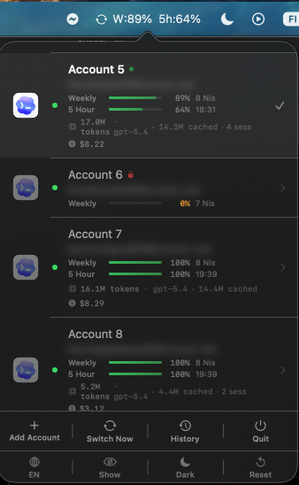

# CodexSwitcher

A macOS menu bar app that manages multiple OpenAI Codex accounts and automatically switches between them when usage limits are reached — no manual login/logout needed.


<p align="center">
  
</p>

---

## Features

- **Auto-switching** — Detects rate limits via API verification and switches to the best available account
- **Smart selection** — Picks the account with the lowest weekly usage %, not just round-robin
- **Codex auto-restart** — Automatically force-quits and relaunches Codex after every account switch
- **Per-event token attribution** — Accurate per-account token tracking using delta computation (matches CodexBar)
- **Cost tracking** — Per-account USD cost with model-specific pricing for gpt-4.x, gpt-5.x, o3, o4-mini
- **Rate limit bars** — Weekly and 5-hour (Plus/Pro) remaining progress bars per account
- **Rate limit forecasting** — Estimates time-to-exhaustion based on usage pace
- **Account health indicators** — 🟢 healthy · 🟡 stale token · ⚪ unchecked · 🔒 exhausted
- **Live session indicator** — Green pulse when Codex is actively using tokens
- **Switch history** — Full log with type icons: ⚡ auto-switch · ↔ manual switch
- **80% warning** — Notification when an account is approaching its weekly limit
- **Restored notifications** — Get notified when a rate-limited account becomes available again
- **Re-login flow** — Refresh stale tokens without leaving the app
- **Reset statistics** — Clear token/cost data with one click
- **Email privacy** — One-click blur toggle for email addresses
- **Dark / Light mode** — Persistent appearance preference
- **TR / EN language** — Turkish and English UI (auto-detects system language)
- **Account aliases** — Friendly names per account, rename via right-click
- **Auth recovery** — Automatic recovery if `~/.codex/auth.json` is corrupted
- **Switch verification** — Post-switch confirmation with automatic rollback on failure
- **Zero dependencies** — Pure Swift, no external packages

---

## Requirements

- macOS 26 (Tahoe) or later
- [OpenAI Codex CLI](https://github.com/openai/codex) installed (`codex` in `$PATH`)

---

## Installation

1. Download `CodexSwitcher-vX.X.X-signed.zip` from the [Releases](../../releases) page
2. Unzip and move `CodexSwitcher` to `/Applications`
3. Launch — the app appears in the menu bar

> The app is signed with a Developer ID certificate and notarized by Apple. No Gatekeeper warning on first launch.

To launch at login: **System Settings → General → Login Items** → add `CodexSwitcher`.

---

## How It Works

```
~/.codex/auth.json          ← active account credentials (Codex reads this)
~/.codex/sessions/*.jsonl   ← session logs (CodexSwitcher monitors for rate limits)
~/.codex-switcher/profiles/ ← stored credentials per account
~/.codex-switcher/cache/    ← token delta cache for fast attribution
```

1. CodexSwitcher watches `~/.codex/sessions/` for rate-limit signals
2. On detection it calls the Codex rate-limit API to **confirm** the limit is actually reached (no false positives from keywords in code or temporary 429s)
3. If confirmed, it atomically replaces `~/.codex/auth.json` with the best available account
4. Codex is force-quit and relaunched automatically so it picks up the new credentials
5. The switch is verified — if verification fails, automatic rollback occurs

---

## Adding Accounts

1. Click the menu bar icon → **Add Account** (`+`)
2. Browser opens automatically for sign-in
3. Sign in with your account
4. CodexSwitcher detects the new credentials automatically
5. Optionally give the account an alias → click **Save**

---

## Usage

| Action | How |
|--------|-----|
| Switch account | Click an account row |
| Force switch to next | Click **Switch Now** in the footer |
| View switch history | Click **History** in the footer |
| Rename account | Right-click → **Rename** |
| Delete account | Right-click → **Delete** |
| Re-login stale account | Right-click → **Re-login** |
| Reset token statistics | Settings bar → ↺ |
| Blur/show emails | Settings bar → 👁 |
| Toggle dark/light | Settings bar → 🌙/☀️ |
| Change language | Settings bar → 🌐 (Auto → TR → EN) |

---

## Changelog

### v1.9.1
- **Codex force-quit** — Switched from `terminate()` to `forceTerminate()` (SIGKILL); eliminates the "Quit Codex?" confirmation dialog
- **App icon fix** — Icon now correctly appears in Dock and Finder

### v1.9.0
- **Codex auto-restart** — Codex is automatically closed and relaunched after every account switch; no more manual exit required
- **History icons** — Switch history entries now show ⚡ (orange, auto) or ↔ (blue, manual) icons
- **Signed & notarized** — App signed with Developer ID and notarized by Apple; no Gatekeeper warning

### v1.8.2
- **API-verified auto-switch** — Rate limit detection now confirms via API before switching; eliminates false positives from "rate_limit" strings in user code or temporary 429 errors

### v1.8.1
- **Window-aware baseline** — Long-running sessions spanning the 7-day window boundary no longer produce token spikes on the first in-window event
- **No-history attribution** — Tokens from before any switch history are dropped rather than incorrectly assigned to the first account

### v1.8.0
- **Per-event delta attribution** — Complete rewrite of token parser using per-event delta computation (same approach as CodexBar); eliminates billions of misattributed tokens from cumulative totals

### v1.7.0
- **Energy optimization** — Polling interval increased from 60s to 300s; file descriptor leak fixed; 10s debounce on token refresh
- **Reset statistics** — Clear all token/cost/forecast data with one click
- **Model name display** — Most-used model shown per account
- **Re-login flow** — Refresh expired tokens for stale accounts without leaving the app
- **80% limit warning** — Notification when weekly usage crosses 80%

---

## Architecture

| File | Responsibility |
|------|---------------|
| `AppStore.swift` | Central state, profile CRUD, smart switching, rate limit polling, Codex restart |
| `ProfileManager.swift` | Auth file management, verification, backup/rollback |
| `SessionTokenParser.swift` | Per-event delta attribution with 7-day window and account mapping |
| `RateLimitFetcher.swift` | API polling for rate limit data |
| `RateLimitForecaster.swift` | Usage pace analysis and exhaustion prediction |
| `CostCalculator.swift` | USD cost calculation with model-specific pricing |
| `UsageMonitor.swift` | FSEvents-based session log watcher |
| `MenuContentView.swift` | Popover UI with inline navigation |
| `BundleExtension.swift` | Bundle.appResources — correct icon lookup in signed .app |
| `L10n.swift` | TR/EN localization |

---

## Contributing

Pull requests are welcome. Please open an issue first for major changes.

1. Fork the repo
2. Create a branch: `git checkout -b feature/your-feature`
3. Commit: `git commit -m 'feat: add your feature'`
4. Push: `git push origin feature/your-feature`
5. Open a Pull Request

---

## License

MIT — see [LICENSE](LICENSE)

---

## Author

**Senol Dogan** — Senior Full Stack Developer

- Website: [senoldogan.dev](https://www.senoldogan.dev)
- Email: [contact@senoldogan.dev](mailto:contact@senoldogan.dev)
- LinkedIn: [linkedin.com/in/senoldogann](https://www.linkedin.com/in/senoldogann)
- X / Twitter: [@senoldoganx](https://x.com/senoldoganx)
